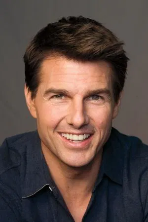
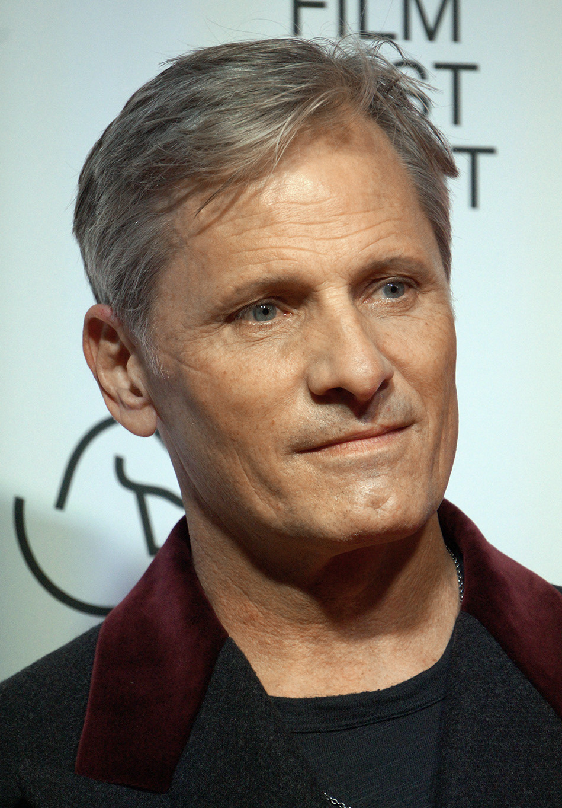

# Pairing recommendations for `subject1_male`

_Generated 2026-05-03T22:20:13. Subject gender from session_id: **male**. Candidates filtered to same gender (manual labels from metadata.py)._

## We will swap you onto these top 3 identities

### DFM swap models (DeepFaceLive)

| #1 | #2 | #3 |
| --- | --- | --- |
|  |  |  |
| **Tom Cruise** cosine 0.0561, age 64 | **Viggo Mortensen** cosine 0.0398, age 68 | **Daniel Radcliffe** cosine 0.0300, age 37 |

## Full ranking — DFM models

| Rank | File | Identity | Cosine | Category | Gender | Age |
|---|---|---|---|---|---|---|
| 1 | `Tim_Chrys` | Tom Cruise | 0.0561 | far | male | 64 |
| 2 | `Viggo_Mortinnsen_384` | Viggo Mortensen | 0.0398 | far | male | 68 |
| 3 | `Daniel_Radcliffe_224` | Daniel Radcliffe | 0.0300 | far | male | 37 |
| 4 | `Keanu_Reeves` | Keanu Reeves | -0.0009 | far | male | 62 |
| 5 | `Rob_Doe` | Robert Downey Jr. | -0.0431 | far | male | 61 |
| 6 | `Kim_Jarrey` | Jim Carrey | -0.0738 | far | male | 64 |

### Source images (FaceFusion / inswapper)

| #1 | #2 | #3 |
| --- | --- | --- |
|  |  |  |
| **Asian male 8** cosine 0.1296 | **Anton Firc** cosine 0.0889 | **Elon Musk** cosine 0.0677 |

## Full ranking — source images

| Rank | File | Identity | Cosine | Category | Gender | Age |
|---|---|---|---|---|---|---|
| 1 | `asian_guy8.jpg` | Asian male 8 | 0.1296 | far | male | ? |
| 2 | `firc.jpg` | Anton Firc | 0.0889 | far | male | ? |
| 3 | `Elon_Musk.png` | Elon Musk | 0.0677 | far | male | ? |
| 4 | `Kim Chen Yin.png` | Kim Jong Un | 0.0595 | far | male | ? |
| 5 | `asian_guy.jpg` | Asian male 1 | 0.0573 | far | male | ? |
| 6 | `asian_guy7.jpg` | Asian male 7 | 0.0538 | far | male | ? |
| 7 | `asian_guy6.jpg` | Asian male 6 | 0.0403 | far | male | ? |
| 8 | `Putin.png` | Vladimir Putin | 0.0328 | far | male | ? |
| 9 | `ted_mosby2.jpg` | Josh Radnor (Ted Mosby) | 0.0326 | far | male | ? |
| 10 | `Putin2.png` | Vladimir Putin | 0.0308 | far | male | ? |
| 11 | `tom_cruise.webp` | Tom Cruise | 0.0249 | far | male | ? |
| 12 | `Elon_Musk_blue_bg.png` | Elon Musk | 0.0141 | far | male | ? |
| 13 | `asian_guy3.jpg` | Asian male 3 | 0.0116 | far | male | ? |
| 14 | `Biden.png` | Joe Biden | 0.0096 | far | male | ? |
| 15 | `ted_mosby5.jpg` | Josh Radnor (Ted Mosby) | 0.0069 | far | male | ? |
| 16 | `asian_guy2.jpg` | Asian male 2 | -0.0010 | far | male | ? |
| 17 | `asian_guy5.jpg` | Asian male 5 | -0.0044 | far | male | ? |
| 18 | `asian_guy4.jpg` | Asian male 4 | -0.0194 | far | male | ? |
| 19 | `Lukashenko.png` | Alexander Lukashenko | -0.0334 | far | male | ? |
| 20 | `ted_mosby1.jpg` | Josh Radnor (Ted Mosby) | -0.0439 | far | male | ? |
| 21 | `ted_mosby3.jpg` | Josh Radnor (Ted Mosby) | -0.0488 | far | male | ? |
| 22 | `ted_mosby.jpg` | Josh Radnor (Ted Mosby) | -0.0530 | far | male | ? |
| 23 | `ted_mosby.png` | Josh Radnor (Ted Mosby) | -0.0530 | far | male | ? |
| 24 | `ted_mosby1_1.jpg` | Josh Radnor (Ted Mosby) | -0.0530 | far | male | ? |
| 25 | `ted_mosby6.jpg` | Josh Radnor (Ted Mosby) | -0.0616 | far | male | ? |
| 26 | `ted_mosby4.jpg` | Josh Radnor (Ted Mosby) | -0.0696 | far | male | ? |
| 27 | `rdj.jpg` | Robert Downey Jr. | -0.1023 | far | male | ? |
