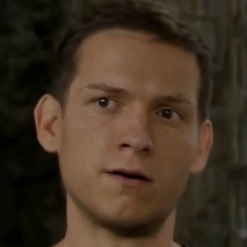
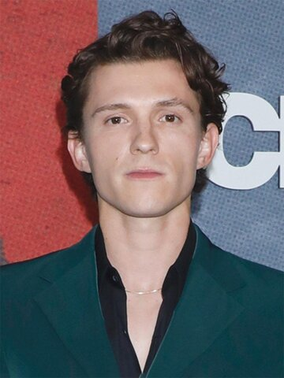

# Pairing recommendations for `subject1_male`

_Updated 2026-05-16. Subject gender: **male**. Cosine similarity to subject1 embedding (ArcFace buffalo_l, averaged across 3 real videos)._

## Top 2 selected identities

### DFM swap models (DeepFaceLive)

Cosine computed on **post-swap embedding** — subject1's face is run through the .dfm model, then the result is re-embedded.

| #1 (dfm1) | #2 (dfm2) |
| --- | --- |
|  |  |
| **Bryan Greynolds** cosine 0.0129, far, male | **Tim Norland** cosine −0.0074, far, male |

### FF identities (FaceFusion / inswapper)

Cosine computed on **source image embedding** (averaged across all available source photos per identity).

| #1 (ff1) | #2 (ff2) |
| --- | --- |
|  |  |
| **Tom Holland** cosine 0.0002, far, male | **Ted Mosby (Josh Radnor)** cosine −0.0423, far, male |
